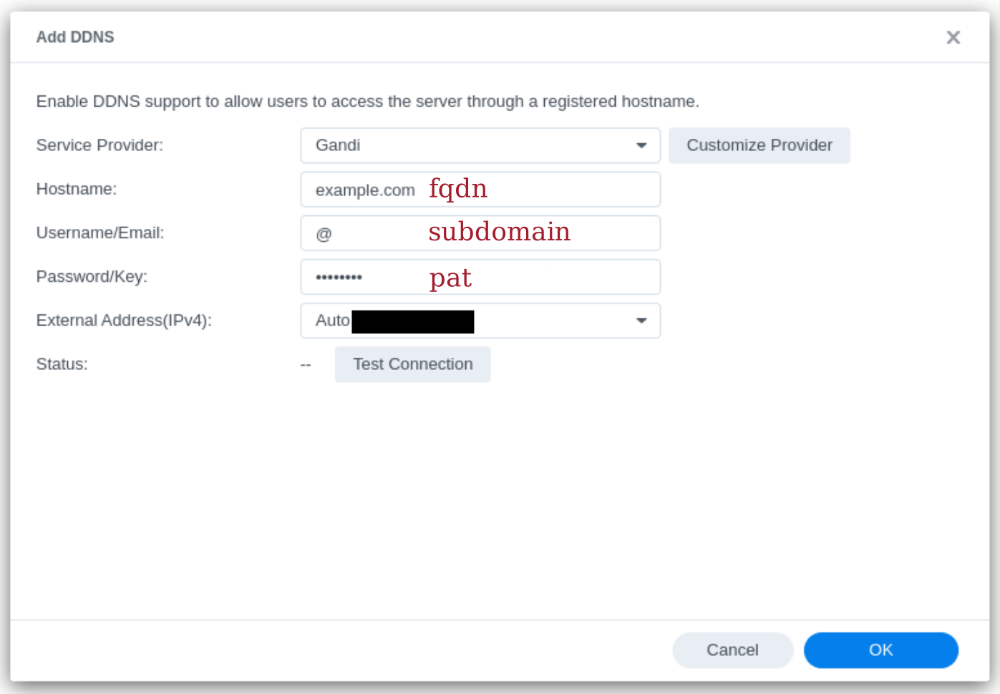

# 
synology-ddns-gandi

Add the Gandi DNS provider to Synology DDNS service. 

This is a native integration. The advantage over a task scheduled every X hours is that, as soon as the IP change, the Synology's DDNS service updates it immediately. As a result, the NAS is always reachable. This cannot be ensured with a periodic update.

I provide two modules, an IPv4 only version, which is supposed to be the only possibility with the current DSM release. But I also provide a IPv4 + IPv6 version which fetches the IPv6 of the default gateway. Therefore, you do not have the choice like with the IPv4. Consequently, if the IPv6 change, but not the IPv4, the record will not be updated. However, the service does update both IPs, once every 24 hours.

Since the information required are not standard, the field names in the Synology interface do not necessarily match the inputs. But I explain everything in the setup section. 

The installation is simple, you download and write the code directly from GitHub using curl.

## Installation
1. Switch to root user: `sudo -s`
2. Install the module: 
   1. IPv4 only: `curl -w "\n" https://raw.githubusercontent.com/EmixamPP/synology-ddns-gandi/main/gandi.php > /usr/syno/bin/ddns/gandi.php`
   2. IPv4 + IPv6: `curl https://raw.githubusercontent.com/EmixamPP/synology-ddns-gandi/main/gandi_ipv6.php > /usr/syno/bin/ddns/gandi.php`
3. Update file permissions: `chmod 755 /usr/syno/bin/ddns/gandi.php`
4. Add it to the provider list: `curl -w "\n" https://raw.githubusercontent.com/EmixamPP/synology-ddns-gandi/main/ddns_provider.conf >> /etc.defaults/ddns_provider.conf`

## Setup
1. Obtain your Gandi api key from your Gandi account's security page (https://account.gandi.net/fr/users/<username>/security)
2. Let your fully qualified domain (fqdn) name be: example.com 
3. Let the subdomain that you want to redirect be all: @
4. Then fill the Synology DDNS configuration as follows:
      
